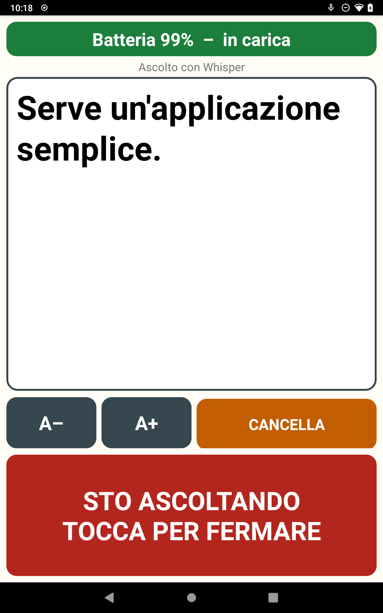

# Parla Facile

Sottotitoli dal vivo per chi ci sente poco: un tablet Android (provato su Nexus 7 2013 con LineageOS) che con una sola pressione scrive a caratteri enormi quello che gli viene detto.



- **Riconoscimento vocale a scelta:** offline sul tablet (Vosk), con un server Whisper nel PC di casa, con servizi online (Groq, OpenAI, Google Cloud) o col servizio vocale di Android. Se un motore cade, l'app passa da sola a Vosk.
- **Modalità ibrida:** Vosk scrive subito il testo provvisorio, Whisper lo corregge appena risponde.
- **Parole personalizzate:** nomi e parole in dialetto per il server Whisper (`parole.txt`, `sostituzioni.txt`).
- **Correzione facoltativa** di punteggiatura e maiuscole con un piccolo modello di linguaggio (Ollama).
- **Chiosco:** l'app è la schermata Home; un pannello nascosto (5 tocchi sulla barra della batteria) permette di configurare tutto.

## Documentazione

- [`PROGETTO.md`](PROGETTO.md): cosa fa, installazione sul tablet, uso quotidiano.
- [`ARCHITETTURA.md`](ARCHITETTURA.md): architettura completa, misure, sicurezza, limiti.
- [`ParlaFacile_presentazione.pdf`](ParlaFacile_presentazione.pdf): presentazione in 9 pagine.

## Avvio rapido

Tablet collegato via USB con il debug attivo (dettagli in `PROGETTO.md`):

```bash
./setup.sh --solo-verifica    # controlla il tablet, non cambia nulla
./setup.sh --chiosco          # scarica il modello vocale, compila, installa e configura
```

Server Whisper nel PC di casa (facoltativo):

```bash
python3 -m venv .venv-whisper && .venv-whisper/bin/pip install faster-whisper
cp server/parole.example.txt server/parole.txt                 # i tuoi nomi e parole
cp server/sostituzioni.example.txt server/sostituzioni.txt     # le tue correzioni
.venv-whisper/bin/python server/whisper_server.py --modello small
```

Poi, sul tablet, 5 tocchi sulla barra della batteria e si scrive `IP-del-PC:8000`.

## Privacy e sicurezza

- Con il server di casa l'audio non esce dalla rete locale; con Groq, OpenAI o Google va su un server esterno.
- Il server di casa non ha password e parla in HTTP in chiaro: usalo solo su una rete fidata.
- La chiave API dei servizi online è salvata in chiaro sul tablet.

## Licenza

[MIT](LICENSE). Dipendenze: Vosk (Apache 2.0) con il suo modello italiano, faster-whisper (MIT) e i modelli Whisper (MIT).
