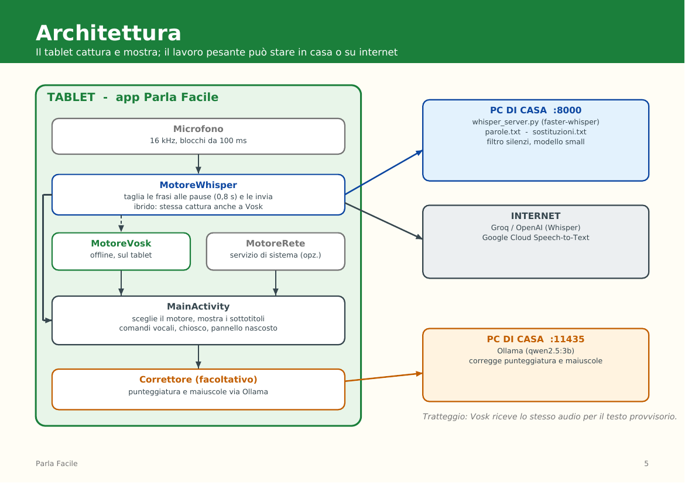
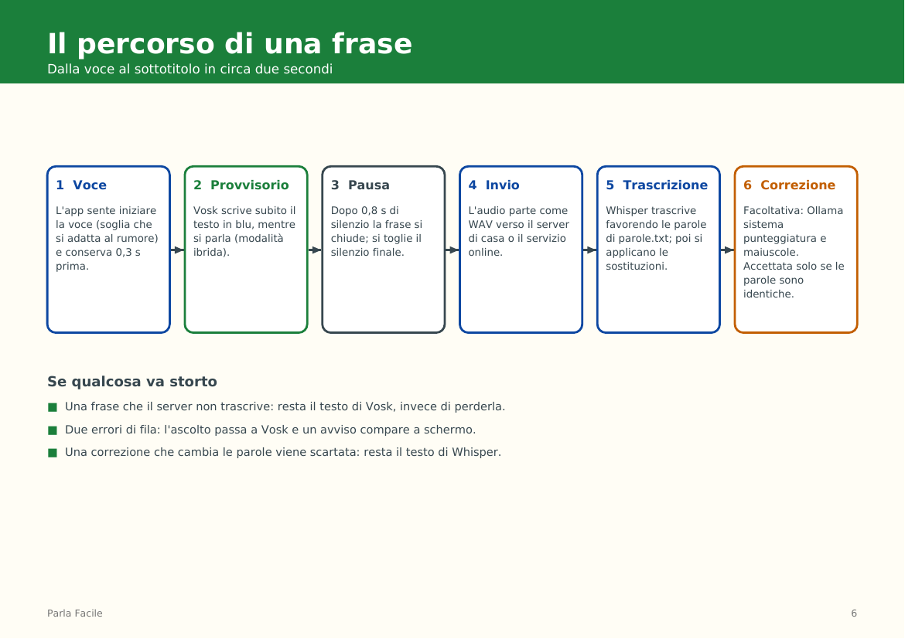
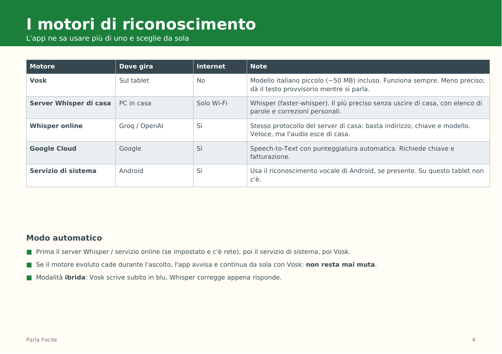
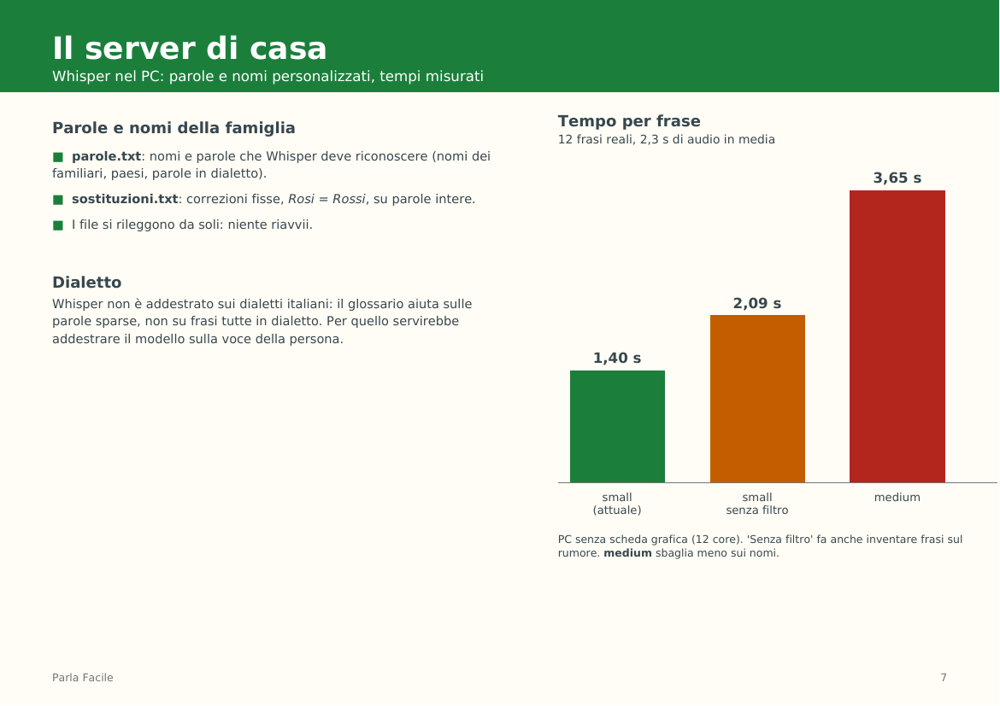

# Parla Facile

[](https://github.com/d4niele/parlafacile/actions/workflows/ci.yml)
[](LICENSE)

Sottotitoli dal vivo per chi ci sente poco: un tablet Android (provato su Nexus 7 2013 con LineageOS) che con una sola pressione scrive a caratteri enormi quello che gli viene detto.


- **Riconoscimento vocale a scelta:** offline sul tablet (Vosk), con un server Whisper nel PC di casa, con servizi online (Groq, OpenAI, Google Cloud) o col servizio vocale di Android. Se un motore cade, l'app passa da sola a Vosk.
- **Modalità ibrida:** Vosk scrive subito il testo provvisorio, Whisper lo corregge appena risponde.
- **Parole personalizzate:** nomi e parole in dialetto per il server Whisper (`parole.txt`, `sostituzioni.txt`).
- **Correzione facoltativa** di punteggiatura e maiuscole con un piccolo modello di linguaggio (Ollama).
- **Chiosco:** l'app è la schermata Home; un pannello nascosto (5 tocchi sulla barra della batteria) permette di configurare tutto.

## Scarica l'app

L'APK già pronto (con il modello vocale italiano incluso, circa 95 MB) è nella pagina delle **Release**:

**[⬇ Scarica l'ultima versione](https://github.com/d4niele/parlafacile/releases/latest)**

Si installa dal computer con il tablet collegato e il debug USB attivo:

```bash
adb install -r parlafacile-<versione>.apk
```

Così l'app è installata ma **non** configurata come schermata Home né in modalità chiosco: per quello serve `./setup.sh --chiosco` (vedi sotto). L'APK è firmato con la chiave di debug, quindi va bene per provarla e per un uso privato, non per distribuirla su uno store.

## Come è fatto

**Architettura:** il tablet cattura e mostra; il lavoro pesante può stare in casa o su internet.



**Il percorso di una frase**, dalla voce al sottotitolo in circa due secondi:



**I motori di riconoscimento** tra cui l'app sceglie da sola:



**Il server di casa:** tempi misurati su 12 frasi reali (PC senza scheda grafica).



## Documentazione

- [`PROGETTO.md`](PROGETTO.md): cosa fa, installazione sul tablet, uso quotidiano.
- [`ARCHITETTURA.md`](ARCHITETTURA.md): architettura completa, misure, sicurezza, limiti.
- [`CONTRIBUTING.md`](CONTRIBUTING.md), [`SECURITY.md`](SECURITY.md), [`CHANGELOG.md`](CHANGELOG.md): contribuire, sicurezza, novità.
- [`ParlaFacile_presentazione.pdf`](ParlaFacile_presentazione.pdf): presentazione in 9 pagine.

## Avvio rapido

Tablet collegato via USB con il debug attivo (dettagli in `PROGETTO.md`):

```bash
./setup.sh --solo-verifica    # controlla il tablet, non cambia nulla
./setup.sh --chiosco          # scarica il modello vocale, compila, installa e configura
```

Server Whisper nel PC di casa (facoltativo):

```bash
python3 -m venv .venv-whisper && .venv-whisper/bin/pip install -r server/requirements.txt
cp server/parole.example.txt server/parole.txt                 # i tuoi nomi e parole
cp server/sostituzioni.example.txt server/sostituzioni.txt     # le tue correzioni
.venv-whisper/bin/python server/whisper_server.py --modello small --token UNA-PASSWORD
```

Poi, sul tablet, 5 tocchi sulla barra della batteria: `IP-del-PC:8000` come indirizzo e la stessa password nel campo *Chiave API*.

## Test

```bash
export JAVA_HOME=/percorso/di/jdk-17
./gradlew testDebugUnitTest assembleDebug lintDebug     # app: test sulla JVM, build e lint
cd server && pip install -r requirements-dev.txt && pytest && ruff check .   # server
```

La CI di GitHub esegue gli stessi controlli a ogni modifica, più la ricerca di segreti.

## Privacy e sicurezza

- Con il server di casa l'audio non esce dalla rete locale; con Groq, OpenAI o Google va su un server esterno.
- Il server di casa parla in HTTP in chiaro e, senza `--token`, non ha password: usalo solo su una rete fidata e con la password. Vedi [`SECURITY.md`](SECURITY.md).
- La chiave API dei servizi online è salvata in chiaro sul tablet.

## Licenza

[MIT](LICENSE). Dipendenze: Vosk (Apache 2.0) con il suo modello italiano, faster-whisper (MIT) e i modelli Whisper (MIT).
